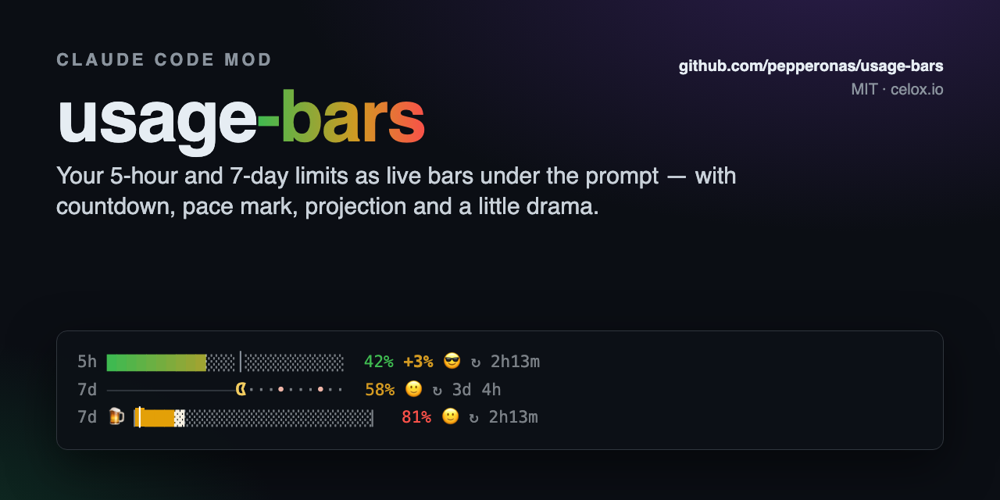
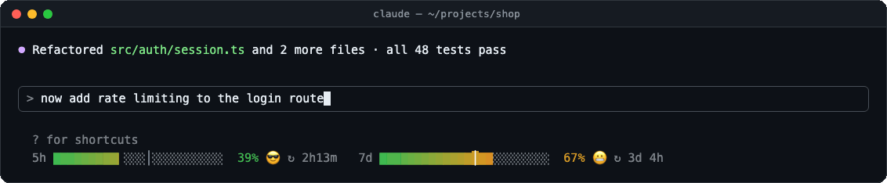
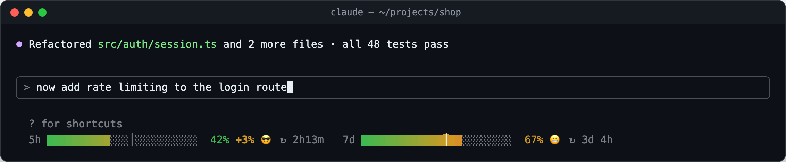
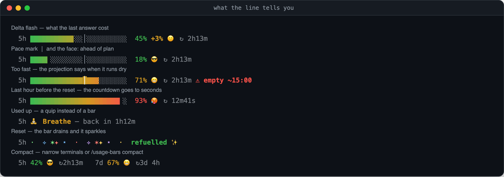
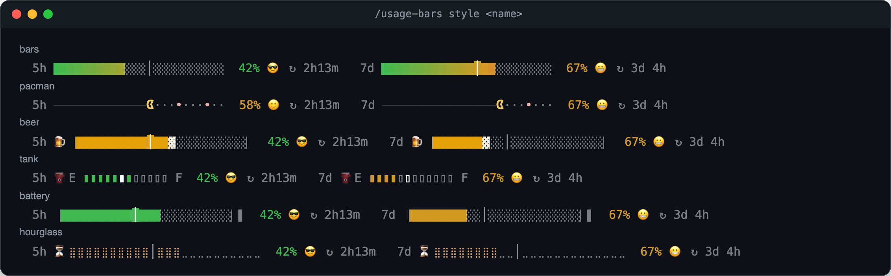
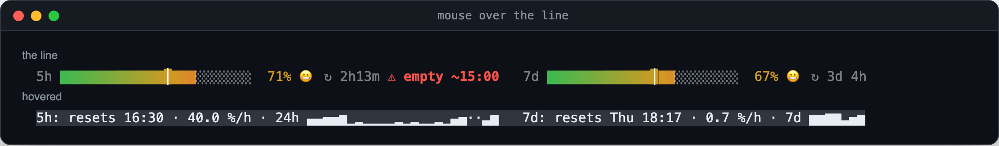

<div align="center">

<a href="https://github.com/pepperonas/usage-bars"></a>

# 📊 usage-bars

**A Claude Code mod that shows your 5-hour and 7-day usage limits as live, animated bars right under the prompt — with reset countdown, pace mark, projection and a little drama.**

<p>
  <a href="#-install"></a>
  &nbsp;
  <a href="#-demo"></a>
</p>

<h3>👉 <code>/plugin marketplace add pepperonas/usage-bars</code> · <code>/plugin install usage-bars@pepperonas</code> — that's it.</h3>

[](CHANGELOG.md)
[](tests)
[](hooks)
[](hooks)

[](https://github.com/pepperonas/usage-bars/actions/workflows/ci.yml)
[](https://code.claude.com/docs/en/plugins/mods/overview)
[](#-requirements)
[](https://www.typescriptlang.org)
[](package.json)
[](package.json)
[](#-how-it-works)
[](#-styles)
[](hooks/i18n.ts)
[](#-privacy)
[](#-testing)
[](CHANGELOG.md)
[](https://semver.org)
[](https://github.com/pepperonas/usage-bars/commits/main)
[](https://github.com/pepperonas/usage-bars/issues)
[](https://github.com/pepperonas/usage-bars)
[](https://github.com/pepperonas/usage-bars/stargazers)
[](https://github.com/pepperonas/usage-bars/forks)
[](#-contributing)
[](LICENSE)

[](https://www.paypal.com/donate/?business=martin.pfeffer@celox.io&currency_code=EUR&item_name=usage-bars)
[](https://g.page/r/CXgdRV3QysvxEBM/review)

</div>

---

> [!NOTE]
> **No guesswork, no network.** The numbers are the rate-limit figures Claude Code itself
> received with its last answer. usage-bars makes no request of its own, reads no token and
> sends nothing anywhere. Countdown, reset detection and projection are computed locally.

## 🎬 Demo



<sub>An answer arrives — the 5-hour bar glides up and <b>+3%</b> flashes, so you see what that prompt cost. Then the 7-day window resets and the bar drains with a sparkle. Run <code>/usage-bars demo</code> to see it in your own terminal.</sub>

## 📸 Screenshots



<sub>Where it lives: one line under the prompt's hint line. Everything else in Claude Code stays as it was.</sub>

### What the line tells you



### 🎨 Styles



<sub><code>bars</code> and <code>pacman</code> show what you <b>used</b>; <code>beer</code>, <code>tank</code>, <code>battery</code> and <code>hourglass</code> show what is <b>left</b>. Switch with <code>/usage-bars style &lt;name&gt;</code> — or just <code>/usage-bars pacman</code>.</sub>

### Hover card



<sub>Point at the line for reset times, your burn rate and sparklines of the last 24 hours and 7 days — where the surface reports the pointer (the desktop app; terminals that pass mouse movement).</sub>

<sub>Every image above is rendered from the mod's own renderer (<code>hooks/row.ts</code>, <code>hooks/styles.ts</code>) by <code>npm run screenshots</code> — not drawn by hand.</sub>

## ✨ Features

- **Two bars, one line** — the 5-hour and the 7-day window side by side, with percent and time until reset. Colour runs green → yellow → red along the bar; eighth blocks (`▏▎▍▌▋▊▉█`) give eight steps per cell, so even a 1 % move is visible.
- **Delta flash** — after every answer, `+3%` appears next to the number, bold at first, then fading out over four seconds. You see what *that* prompt cost, not just the total.
- **Gliding bars** — new values ease in over 0.7 s instead of jumping. Animation runs at ~30 fps only while something moves; at rest the mod redraws once a minute.
- **Pace mark `│`** — where you would be if you spread the window evenly. Fill left of the mark: you're fine. Right of it: you're burning faster than the window lasts.
- **A face that reads your pace** — 😎 ahead of plan · 🙂 on plan · 😬 too fast · 🥵 from 90 % · 💀 at 100 %. It follows *how* you work, not just how full the bar is.
- **Projection** — from the samples of the current window the mod computes your burn rate; if you'd run dry before the reset you get `⚠ empty ~16:40`. Silent when you'll make it.
- **Seconds countdown** — `↻ 2h13m`, and in the last hour `↻ 12m41s`.
- **Reset, even when idle** — the numbers only change when Claude Code gets an answer. If the window resets while you're away, the mod notices from the reset time, drains the bar to 0 and sparkles: `refuelled ✨`.
- **100 % gets a quip** — `☕ Coffee break – back in 1h12m`, one of seven, stable per window.
- **Toasts** at 50 / 80 / 90 / 100 %, once per window (remembered across sessions), with an optional chime at 90 % and on reset.
- **Six styles** — `bars`, `pacman` (a ghost chases Pac-Man from 90 %), `beer`, `tank`, `battery` (⚡ flashes when nearly empty), `hourglass`.
- **Compact mode** — `5h 42% 😎 ↻2h13m   7d 67% 😬 ↻3d 4h`; automatic below 72 columns.
- **Stats** — `/usage-bars stats`: burn rate, projection, sparklines of your 5-hour peaks over 24 h and 7 days, your record.
- **English and German** — `/usage-bars lang de`.
- **Shows what may follow** — type `/usage-bars ` and the line under the prompt lists the subcommands, narrowing as you type (`st` → **st**ats · **st**yle), with what a single match does. Claude Code completes a command's name but not its arguments, so the mod shows them itself.
- **Respects your settings** — everything animated can be switched off (`/usage-bars anim off`), sound is off by default.

## 📥 Install

### Requirements

- **Claude Code with mods** — mods are on by default in current releases; usage-bars is tested with **2.1.289**.
- **A Claude subscription login** (Pro / Max / Team). The 5-hour and 7-day windows exist only there; with an API key Claude Code reports no rate-limit windows, and the line stays hidden.

### Option 1 — marketplace (recommended)

The repository is its own plugin marketplace. In Claude Code:

```
/plugin marketplace add pepperonas/usage-bars
/plugin install usage-bars@pepperonas
```

or from the shell:

```bash
claude plugin marketplace add pepperonas/usage-bars
claude plugin install usage-bars@pepperonas
```

The bars appear after the first answer — that's when Claude Code first learns your limits. Update with `/plugin marketplace update pepperonas`, then `claude plugin update usage-bars@pepperonas`. Settings: `/plugin configure usage-bars@pepperonas` (every option has a default, so you can skip it).

### Option 2 — skills folder

Claude Code loads a plugin it finds in `~/.claude/skills/<name>` by itself, in every session:

```bash
git clone https://github.com/pepperonas/usage-bars ~/.claude/skills/usage-bars
```

Update with `git -C ~/.claude/skills/usage-bars pull`. If you also install it from the marketplace, the marketplace copy wins and the skills-folder copy is not loaded.

### Option 3 — one session

```bash
git clone https://github.com/pepperonas/usage-bars
claude --plugin-dir ./usage-bars
```

### Option 4 — desktop app and SDK hosts

Where you can't pass a flag, name the folder in `CLAUDE_CODE_PLUGIN_DIRS` — in your shell environment or in the `env` block of `~/.claude/settings.json`:

```json
{ "env": { "CLAUDE_CODE_PLUGIN_DIRS": "~/src/usage-bars" } }
```

## 🕹️ Usage

| Command | What it does |
|---|---|
| `/usage-bars` | Help and the current settings |
| `/usage-bars stats` | Burn rate, projection, sparklines (24 h / 7 d), record |
| `/usage-bars demo` | Plays the animation once |
| `/usage-bars full` · `compact` · `off` | Display mode |
| `/usage-bars style <name>` | `bars` · `pacman` · `beer` · `tank` · `battery` · `hourglass` (also `/usage-bars pacman`) |
| `/usage-bars lang en` · `de` | Language of the line, toasts and commands |
| `/usage-bars anim` · `sound` · `toasts` · `face` `[on\|off]` | Switches; without `on`/`off` they toggle |

The command runs immediately, even while Claude is working. While you type it, the line under the prompt lists what may follow — after `style ` the styles, after `lang ` the languages, after a switch `on · off`. It's a list to read, not Tab completion: Claude Code doesn't let a mod complete arguments.

## ⚙️ Configuration

The defaults live in `/config` under **usage-bars**:

| Field | Values | Default |
|---|---|---|
| `style` | `bars` `pacman` `beer` `tank` `battery` `hourglass` | `bars` |
| `mode` | `full` `compact` `off` | `full` |
| `language` | `en` `de` | `en` |
| `animation` | on / off | on |
| `sound` | on / off | off |
| `toasts` | on / off | on |
| `face` | on / off | on |

`style`, `mode` and `language` are typed in as text; a value the mod doesn't know falls back to the default. What you set with `/usage-bars` is stored and wins over `/config` — so a quick `/usage-bars pacman` sticks across sessions.

## 🧠 How it works

```
 Claude Code answer ──► session.measure ──► apply()            ──► $.state  ──► ui.render (PromptHint)
 (rate-limit figures)    (a window moved      glide · delta ·        limits      engine's hint line
                          a whole point)      toast · history        motion      + the bars line
                                                                     deltas
 1 s ticker ──────────► reset passed? ──► zero it + sparkle          party
                       last hour?     ──► redraw every second        history ──► $.store (8 days)
 animation ───────────► 30 fps while something moves, then stops
```

- **Source of truth.** `session.start` reads `$.session.usage()`; after that, `session.measure` pushes new figures whenever a window moves by a whole point. Nothing is polled.
- **Drawing.** A `ui.render` hook on the `PromptHint` component returns the engine's own hint line *plus* one row — the shortcuts and pills keep working.
- **Pace.** `elapsed = 1 − (resetsAt − now) / window`; the mark sits at that share of the bar, and `used / elapsed` picks the face.
- **Projection.** Burn rate = rise since the first sample *inside the current window* ÷ time; it needs 10 minutes of samples and a rising value. Samples from the previous window never count.
- **History.** Up to 3000 samples, 8 days, in `$.store` — that's what the sparklines, the record and the once-per-window toasts are built on.

### 🔒 Privacy

usage-bars makes **no network request**, reads **no credentials** and writes only its own key-value store (history, settings, which toasts were shown). Its hooks are listed by `claude plugin validate .`:
`$.audio.play, $.clock.*, $.command.register, $.session.usage, $.state.*, $.store.*, $.ui.invalidate, $.ui.resolve, $.ui.toast`.

## 🏛️ Architecture

| File | Role |
|---|---|
| [`hooks/register.tsx`](hooks/register.tsx) | The mod: hooks, state, ticker, animation loop, `/usage-bars` |
| [`hooks/row.ts`](hooks/row.ts) | Pure: one window's segment of the line, and the hover card |
| [`hooks/styles.ts`](hooks/styles.ts) | Pure: the six styles, gradient, sparkle |
| [`hooks/format.ts`](hooks/format.ts) | Pure: countdown, clock, pace, face, burn rate, projection, history |
| [`hooks/i18n.ts`](hooks/i18n.ts) | English and German strings |
| [`types/index.d.ts`](types/index.d.ts) | The state contract (`PluginState['usage-bars']`) |
| [`sounds/`](sounds) | Two short chimes, generated, no third-party audio |
| [`tools/screenshots.ts`](tools/screenshots.ts) | Renders every image in this README from `row.ts` / `styles.ts` |

Everything that decides *what* is drawn is pure and engine-free — which is why it can be tested with plain Node and rendered into screenshots.

## 🧪 Testing

There are two suites, and the split is deliberate.

**Node suite** — `tests/*.spec.ts`, plain `node:test`, no Claude Code needed; this is what CI runs. It covers the pure logic (countdown, pace, projection, history, every style at every value, the row in every state, both languages) and **drift guards** that hold this README to the code: the version badge to `plugin.json` and `package.json`, the test-count badges to the real number of tests, every style and command to the docs, every `/config` field to the table above, the CHANGELOG to the version, the marketplace entry to the manifest, and that no lockfile ships (Claude Code would install the dev tools for every user).

**Engine suite** — `hooks/*.test.ts(x)`, run by `claude plugin test .` against Claude Code's own engine: the line is drawn on the `terminal` *and* `desktop` surfaces, a measure makes the bar glide and the delta flash and fade, a threshold toasts exactly once, an idle reset drops to 0 with a party, `/usage-bars` switches mode, style, language and flags, and settings survive a new session.

**Every new test is mutated once.** A test that has never been seen red is not an assurance. So each guarded behaviour gets its bug put back (reset detection off, threshold check removed, delta dropped, glide skipped, projection hidden, settings not stored, ease-out removed) and the suite must go red — seven of seven did.

```bash
npm install              # dev tools only; the mod itself has no dependencies
npm test                 # node suite (CI)
claude plugin test .     # engine suite
claude plugin validate . # what the module hooks and calls
npm run screenshots      # re-render docs/ (needs `npx playwright install chromium` and ffmpeg)
```

## ❓ FAQ

**The bars don't show up.** They appear after the first answer of a session — that's when Claude Code learns your limits. With an API key there are no 5-hour/7-day windows at all, so the line stays hidden. `/usage-bars` tells you whether the mod is loaded; if it says `mode off`, run `/usage-bars full`.

**Why does the number lag behind `/usage`?** The bars show what came with the *last answer*. Between answers nothing new arrives — except the reset, which the mod detects from the reset time.

**The hover card never appears.** It needs a surface that reports the pointer: the desktop app does; in a terminal it depends on mouse reporting. `/usage-bars stats` shows the same and more.

**I hear nothing.** Sound is off by default: `/usage-bars sound on`.

**It's too much motion.** `/usage-bars anim off` — bars jump, the delta stays without fading, no sparkle.

**Can I add a style?** Yes — one function in `hooks/styles.ts`, its name in `STYLES`, `types/index.d.ts` and `plugin.json`. The drift guards tell you if you forgot the README.

## 📝 Changelog

The full history is in [CHANGELOG.md](CHANGELOG.md) ([Keep a Changelog](https://keepachangelog.com/en/1.1.0/)).

- **0.4.0** — typing `/usage-bars ` lists what may follow, under the prompt.
- **0.3.3** — ready for the Claude plugin directory: a listing icon, and `/config` fields the directory accepts.
- **0.3.2** — installs no dev tools for users (no lockfile in the plugin root).
- **0.3.1** — installable from a plugin marketplace: `/plugin install usage-bars@pepperonas`.
- **0.3.0** — English and German, a Node test suite with drift guards, rendered screenshots; the pace mark is a thin line on the fill.
- **0.2.0** — animation, delta, pace, face, projection, reset party, toasts, six styles, `/usage-bars`.
- **0.1.0** — two bars under the prompt.

## 🤝 Contributing

Issues and pull requests are welcome. Please keep both suites green (`npm test`, `claude plugin test .`) and put the bug back once before you trust a new test. A change to a command, a style, a setting or the version usually needs its counterpart in this README in the same PR — the drift guards will point at it.

## 💛 Support

usage-bars is free and stays that way. If it saves you a surprise at 100 %:

- ⭐ **Star the repo** — it helps others find it.
- 💶 **[Donate with PayPal](https://www.paypal.com/donate/?business=martin.pfeffer@celox.io&currency_code=EUR&item_name=usage-bars)** — keeps it maintained.
- 📝 **[Rate celox.io on Google](https://g.page/r/CXgdRV3QysvxEBM/review)** — helps just as much.

## 📄 License

MIT © 2026 **Martin Pfeffer** · [celox.io](https://celox.io). See [LICENSE](LICENSE).

usage-bars is an independent community project and is not affiliated with or endorsed by Anthropic. *Claude* and *Claude Code* are trademarks of Anthropic, PBC.
